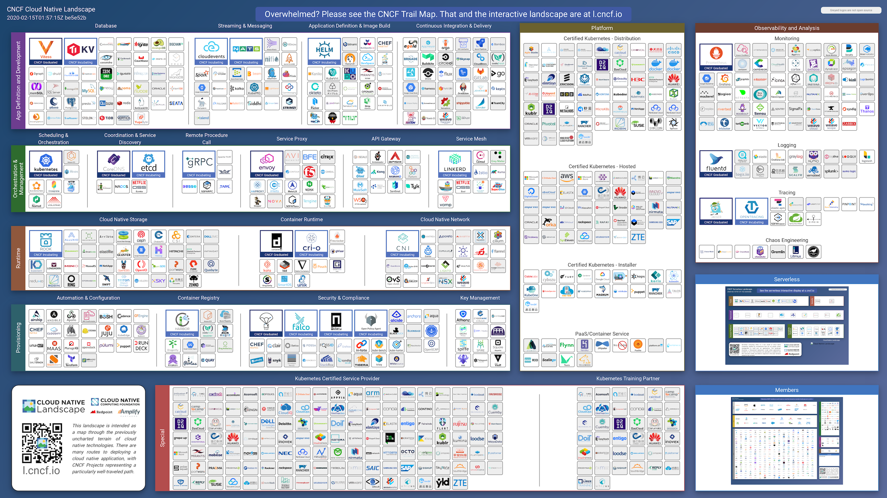
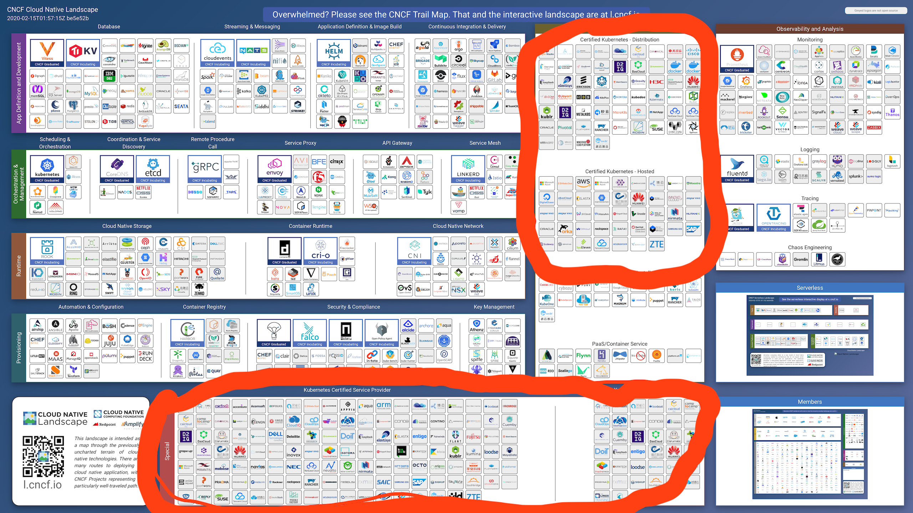
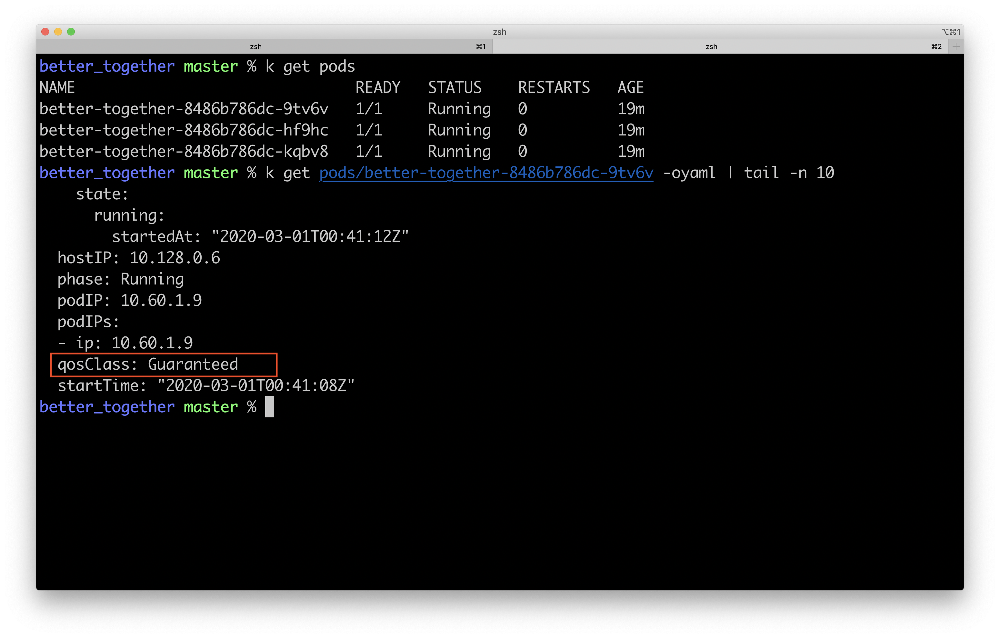
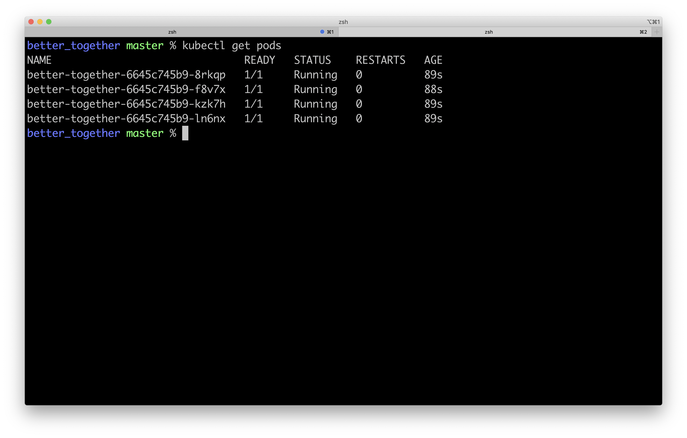
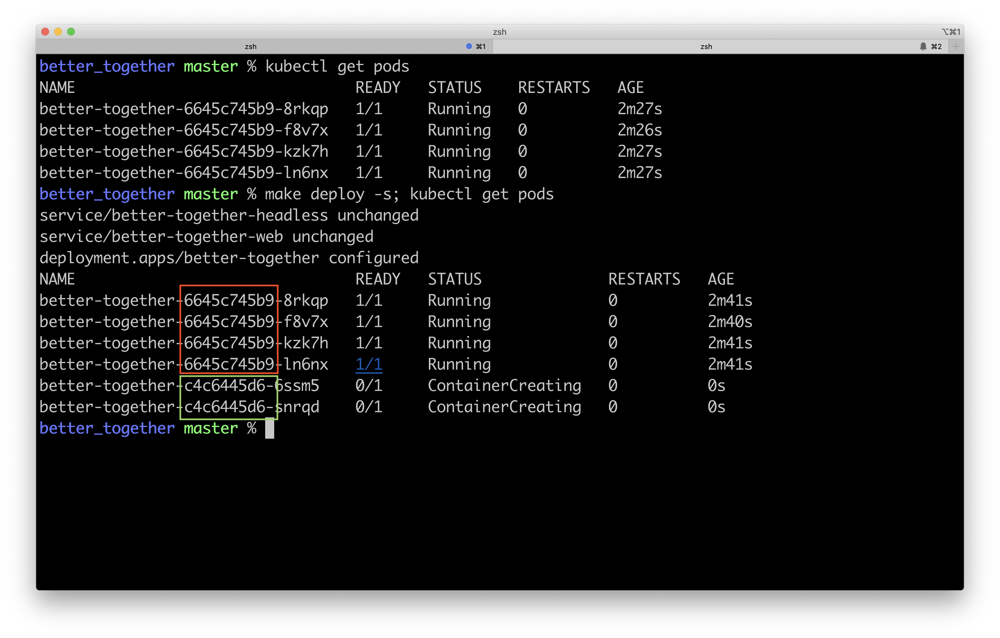
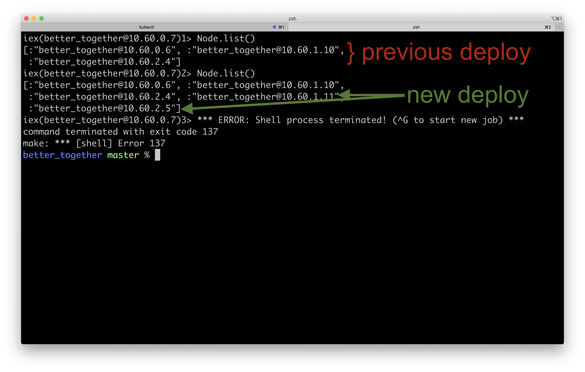

theme: work, 3
quote: #f1be52, Helvetica
quote-author: #fff, "Work Sans"

# <br />

# <br />

# <br />

# <br />

# <br />

# <br />

# <br />

# BEAM

# and

# Kubernetes:

# [fit] Better Together?


^ Stormy Seas

^ Thanks for coming out despite the plague.

^ Appreciate the opportunity, hope everyone makes it home safe

^ Clustering exercise...

^ Zero trust, devsecops i like it

---

# Cory O'Daniel

- Maintainer: Bonny, k8s.ex, Arbor
- Twitter: @coryodaniel
- GitHub: @coryodaniel

Pronounces kubectl: _kube cuddle_ or _kube cartel_ depending on my mood.


^ I'm _onboard_ with Kubernetes.

^ The only thing I love more than mispronouncing kubectl is YAML

---


^ This presentation is YAML AF

---

# [fit] Are they

# [fit] **better**

# [fit] together?

^ So, what you're here for, right?

^ Scientific twitter poll, mix of k8s and not k8s

---

^ Don't get hung up, its a lot of stuff, we'll come back to it.

^ float your boat

^ JUST marketing page features on the left

| Features                                  | Kubernetes                                            |
| ----------------------------------------- | :---------------------------------------------------- |
| Automated Rollouts / Rollbacks            | `Deployment`, `ReplicaSet`, `StatefulSet`             |
| Automated Scheduling (instance placement) | pod/node affinity/anti-affinity, `resources`          |
| Bin Packing                               | `Policy`, `LimitRange`, `resources`                   |
| Batch Jobs / Execution                    | `Job`, `CronJob`                                      |
| Service Discovery / DNS                   | `Service`, `Endpoint`, `EndpointSlices`, external-dns |
| Load Balancing                            | internal & external load balancers                    |
| Storage Orchaestration                    | `PersistentVolume`, `StorageClass`, and CSI           |
| Secret "Management"                       | `Secret`                                              |
| Config Management                         | `ConfigMap`                                           |
| Health Checks                             | Shell, TCP, and HTTP Health Checks                    |
| Horizontal Scaling                        | `HorizontalPodAutoscaler`                             |
| Vertical Scaling                          | `VerticalPodAutoscaler`, `resources`                  |
| QoS                                       | `PodDisruptionBudget`, `resources`                    |
| Security Templates                        | `PodSecurityPolicy`, `securityContext`                |
| Metrics                                   | metric-server, custom-metrics-server                  |

---

^ BEAM doesnt offer some of this stuff

^ Wind in your sails

^ but...

| Feature                                   | Kubernetes                                            |              Beam or Erlang/OTP              |
| ----------------------------------------- | :---------------------------------------------------- | :------------------------------------------: |
| Automated Rollouts / Rollbacks            | `Deployment`, `ReplicaSet`, `StatefulSet`             |               Hot Code Loading               |
| Automated Scheduling (instance placement) | pod/node affinity/anti-affinity, `resources`          |                      -                       |
| Bin Packing                               | `Policy`, `LimitRange`, `resources`                   |                      -                       |
| Batch Jobs / Execution                    | `Job`, `CronJob`                                      |                  Processes                   |
| Service Discovery / DNS                   | `Service`, `Endpoint`, `EndpointSlices`, external-dns |                      -                       |
| Load Balancing                            | internal & external load balancers                    |                      -                       |
| Storage Orchaestration                    | `PersistentVolume`, `StorageClass`, and CSI           |                      -                       |
| Secret "Management"                       | `Secret`                                              |                      -                       |
| Config Management                         | `ConfigMap`                                           |             vm.args, sys.config              |
| Health Checks                             | Shell, TCP, HTTP Health Checks                        |            Supervisors, `-heart`             |
| Horizontal Scaling                        | `HorizontalPodAutoscaler`                             |             Add nodes :thumbsup:             |
| Vertical Scaling                          | `VerticalPodAutoscaler`, `resources`                  |          Add CPUs / RAM :thumbsup:           |
| QoS                                       | `PodDisruptionBudget`, `resources`                    |                      -                       |
| Security Templates                        | `PodSecurityPolicy`, `securityContext`                |                      -                       |
| Metrics                                   | metric-server, custom-metrics-server                  | `erlang:system_info/1` `erlang:statistics/1` |

---

# [fit] Are they

# [fit] **better**

# [fit] together?

^ Easy Answer, of course, so many more features

^ hands up, use k8s
ABSTRATED via ci/cd, hands down
Ops/SRE team, hands down
hands still up DIRECTLY interface with k8s
LIKE K8S, hands down
I know your pain

^ Asking this question, we've made an assumption...
Better question

---

[.header: alignment(center)]

# [fit] **YOUR_ORG** and Kubernetes: Better Together?


^ _your organization_ and Kubernetes: Better Together?

^ **3 MINUTES**

---

# [fit] Your Startup's

# [fit] **MVP**

# [fit] On Kubernetes:


^ This may be funny... until you realized this is barely an exageration.

---

# [fit] Your Startup's

# [fit] **MVP**

# [fit] On Kubernetes:


^ Before rolling k8s out in an organization, I ask a few questions:

^ [Pause] Actually a lot of questions, high notes

^ Do you have an Ops team?

^ No? Can your biz SACRIFICE developer time to learn k8s?
These are people that are hopefully building revenue generating features.

^ Could you reliabily run on Heroku, Zeit, Fargate, or Gigalixer?

^ My motto when approaching new projects is: Bring your experience, not your solutions.

^ Im familiar with the benefits Kubernetes brings and I use Kubernetes for all of my local development, but its certainly not a need.

^ **4:30 MINUTES**

---

[.build-lists: true]

# Kubernetes Best Features

^ Best 3 features werent in that big table

^ Not on landing page / marketing page

^ Wont find them in books

^ [TRANSITION] Kubernetes REST API and kubectl

^ [TRANSITION] Learned Complexity is a feature, home grown complexity is debt

^ [TRANSITION] 100s of companies have contributed to k8s in the last year including: Apple, Amazon, Red Hat, Google, VM Ware, Spotify, Tesla

- A simple, _extendable_ API and client
- Learned Complexity
- Community

---

^ If you were pitching Kubernetes to your team, every single feature in this list could be rebutted with something "simpler."

| Features                                  | Kubernetes                                            |
| :---------------------------------------- | :---------------------------------------------------- |
| Automated Rollouts / Rollbacks            | `Deployment`, `ReplicaSet`, `StatefulSet`             |
| Automated Scheduling (instance placement) | pod/node affinity/anti-affinity, `resources`          |
| Bin Packing                               | `Policy`, `LimitRange`, `resources`                   |
| Batch Jobs / Execution                    | `Job`, `CronJob`                                      |
| Service Discovery / DNS                   | `Service`, `Endpoint`, `EndpointSlices`, external-dns |
| Load Balancing                            | internal & external load balancers                    |
| Storage Orchaestration                    | `PersistentVolume`, `StorageClass`, and CSI           |
| Secret "Management"                       | `Secret`                                              |
| Config Management                         | `ConfigMap`                                           |
| Health Checks                             | Shell, TCP, and HTTP Health Checks                    |
| Horizontal Scaling                        | `HorizontalPodAutoscaler`                             |
| Vertical Scaling                          | `VerticalPodAutoscaler`, `resources`                  |
| QoS                                       | `PodDisruptionBudget`, `resources`                    |
| Security Templates                        | `PodSecurityPolicy`, `securityContext`                |
| Metrics                                   | metric-server, custom-metrics-server                  |

---

# Kubernetes Best Features

^ These features here, aren't offered by a single cloud provider.

^ So lets look at these features.

- A simple, _extendable_ API and client
- Learned Complexity
- Community

---

# [fit] Apps start out

# [fit] **so cute**...


^ They start out so cute.

^ We've got a simple monolith. 100% Coverage, Deploying with SSH.

---

[.build-lists: true]


^ The next thing you know, you've outgrown your PaaS, your VM, or maybe your tooling...

- _Packer_ for VM Images
- _Terraform_ for VM Instances
- _Salt_ or _Chef_ for Configuration
- _KMS_ for Secrets
- Deployin' with _bash_
- _LOL_ for rollbacks
- _Terraform_ or _aws-cli_ for Autoscaling Groups
- Load Balancers, DNS Records, Health Checks, Access Control
- Ports, Firewalls, IAM
- Do I need a _sErvIce MeSH?!1!_

---

[.build-lists: true]


# [fit] **WHEW!**

That's a lot of tooling.

^ WHEW

^ Someone should mash that last slide up with "We Didnt Start Fire"

^ Lots of things to cobble together

^ A lot of tools to be an expert in

^ Lots of things to know how to handle when things go wrong

---

# Aarggh! <br/><br/>Our VMs are only using <br/>**8.3%** <br/>of their CPU.


^ Ok, lets go create a new Launch Config, assign it to our ASG, roll out new instances, and terminate the old ones.

^ Not only are we building more complex applications, we are building more complex operations.

^ **7:30 MINUTES**

---

^ At some point we need to consider the operational complexity _we_ are creating.

# What business value are you **creating** by reinventing the ~~wheel~~ <br/>helm?


---

[.text: alignment(center)]

# [fit] Kubernetes

# is

# [fit] **Complicated**

^ Ok, Cory, sure we are creating complexity, but Kubernetes is COMPLICATED TOO

^ High barrier to entry;

- That should be an Operational Burden
- Partially relieved by EKS/GKE

---

[.text: alignment(center)]

# [fit] Kubernetes

# is

# [fit] ~~Complicated~~

# [fit] **Learned Complexity**

^ A single tool (and API) to manage: workloads, load balancers, service discovery entries, dns records, metrics systems, databases, buckets.

^ Logging, metrics, and alerting all via the same API.

^ And while we are about to look at some technical Kubernetes features, I would argue that these two features (API & Learned Complexity) are what you come to Kubernetes for.

^ Learned complexity that you can take from job-to-job, project-to-project, and cloud-to-cloud.

^ **8:30 MINUTES**

---

^ I have a prediction.

> In the next few years, the Kubernetes API will become the common API for interfacing with cloud resources.

^ I'm going to say it again just in case someone wants to record a video to call me out in three years.

^ That may sound crazy, but...

---

[.build-lists: true]

# What can you deploy today?

- Workloads
- Batch jobs
- Load balancers
- DNS records
- Machine learning models and pipelines (kubeflow)
- DynamoDB Tables, S3 buckets, BigQuery Tables

^ AWS had released the service operator (SNS, SQS, Memcached, Redis)

^ GCP released Config Connector, it allows any GCP resource to be managed by the Kubernetes API.

^ Its Google, so they could deprecate it any moment,
but in the meantime I can manage all of my resources on GCP with kubectl.

^ There is still some work here to do on these tools, but its plausible that one day there won't be need for DeploymentManager, Terraform, or gcloud CLI

---

[.text: alignment(center)]

# [fit] The CNCF and Kubernetes Community



^ the third most important feature

[.footer: Source: [CNCF Cloud Native Interactive Landscape](https://landscape.cncf.io/)]

---

[.text: alignment(center)]

# [fit] HOLY

# [fit] :poop:!!!

---

# [fit] The CNCF and Kubernetes Community



^ Most of the stuff on this page is open-source projects. The stuff circled in red are companies invested in the Kubernetes ecosystem.

[.footer: Source: [CNCF Cloud Native Interactive Landscape](https://landscape.cncf.io/)]

---

[.build-lists: true]

# Recap:

# What to pitch people

# on when **considering Kubernetes**

- A simple, _extendable_ API and client
- Learned Complexity
- Community

---

# [fit] The

# [fit] **Risk**

# [fit] of

# [fit] Kubernetes


^ I know "Unpopular Opinions" are popular on twitter, but how do y'all feel about incendiary opinions?

^ The biggest risk when deploying kubernetes is a leaky abstration that requires your application developers to become intimately familiar with k8s.

^ Everyone that was still standing early, has been exposerd to this risk.

^ DevOps is a practice to make operations better, not another role you toss on your full stack developers.

^ If your application developers are doing "devops", they spending less time building business value.

---

# [fit] Don't Expose Kubernetes to Developers

# [fit] Use

# [fit] **Continuous**

# [fit] **Delivery**

^ When deploying kubernetes (read slide)

^ Having a good CI/CD pipeline in place first, will make for a smoother Kubernetes migration.

[.footer: Don't be a gatekeeper, though, curiousity drives innovation.]

---

# [fit] Leaky Abstraction?!

# <br/>

# [fit] Kubernetes Has A

# [fit] Simple, **Declarative**

# [fit] Interface!!1!

^ You might be thinking...

---


# Spoiler Alert:

# [fit] **No**

# [fit] It

# [fit] Doesn't

---


# Spoiler Alert:

# [fit] No

# [fit] **It**

# [fit] Doesn't

---


# Spoiler Alert:

# [fit] No

# [fit] It

# [fit] **Doesn't**

---

[.text: alignment(center)]

# [fit] A **"declarative"** interface

^ Kubernetes has a (AIR QUOTES) declarative interface

> One person's declarative is another person's imperative
> -- me

^ More features, customization, declarativeness slipping away

^ A lot of _how_ to run our workloads

^ This feels leaky. Its creating additional cognitive operational overload to already complicated applications.

---

[.code-highlight: all]

^ You can't read that can you? Let me reassure you, it's "declarative."

[.code-highlight: 1-2]

^ Ok, not so bad, I got this.

[.code-highlight: 3-5, 10-12, 14-16]

^ Uh ok, thats a lot of Copy/pasta.

[.code-highlight: 21-27]

^ Geez, I dont know, I just want my app to work, dammit.

[.code-highlight: 28-32]

^ This is an excerpt from the eviction operator YAML manifest generated by Bonny. Its about 180 lines long.

^ Now, I love YAML, but in the wise words of Johann Bach

```yaml
apiVersion: apps/v1
kind: Deployment
metadata:
  labels:
    k8s-app: eviction-operator
  name: eviction-operator
  namespace: default
spec:
  replicas: 1
  selector:
    matchLabels:
      k8s-app: eviction-operator
  template:
    metadata:
      labels:
        k8s-app: eviction-operator
    spec:
      containers:
        - image: quay.io/coryodaniel/eviction-operator:0.1.1
          name: eviction-operator
          resources:
            limits:
              cpu: 200m
              memory: 200Mi
            requests:
              cpu: 200m
              memory: 200Mi
          securityContext:
            allowPrivilegeEscalation: false
            readOnlyRootFilesystem: true
            runAsNonRoot: true
            runAsUser: 65534
      serviceAccountName: eviction-operator
```

[.footer: Excerpt from the eviction-operator manifest generated with Bonny. Originally ~180 lines.]

---

> F\*ck that noise.
> -- Johann Bach

---

# [fit] **Ops wants**

# [fit] **Kubernetes,**

# [fit] Devs want

# [fit] Heroku

---

# [fit] Ops wants

# [fit] Kubernetes,

# [fit] **Devs want**

# [fit] **Heroku**

^ Want to see a declarative interface for deploying an app?

---

# <br />

# <br />

# <br />

# <br />

# [fit] `git push`

^ This is a declarative interface for deploying applications.

^ I want my application to run, go do it computer.

---

# So...

# [fit] BEAM

# [fit] and

# [fit] Kubernetes:

# [fit] **Better Together?**

^ let's talk about what we are here for.

---

^ We aren't going to hit all of these, but if you are interested, there is a NodePool party on the rooftop at 6pm

^ Meet me up there and we can go through the rest.

| Feature                                   | Kubernetes                                            |              Beam or Erlang/OTP              |   Can k8s Help?    |
| ----------------------------------------- | :---------------------------------------------------- | :------------------------------------------: | :----------------: |
| Automated Rollouts / Rollbacks            | `Deployment`, `ReplicaSet`, `StatefulSet`             |               Hot Code Loading               |        :x:         |
| Automated Scheduling (instance placement) | pod/node affinity/anti-affinity, `resources`          |                      -                       | :white_check_mark: |
| Bin Packing                               | `Policy`, `LimitRange`, `resources`                   |                      -                       | :white_check_mark: |
| Batch Jobs / Execution                    | `Job`, `CronJob`                                      |                  Processes                   | :white_check_mark: |
| Service Discovery / DNS                   | `Service`, `Endpoint`, `EndpointSlices`, external-dns |                      -                       | :white_check_mark: |
| Load Balancing                            | internal & external load balancers                    |                      -                       | :white_check_mark: |
| Storage Orchaestration                    | `PersistentVolume`, `StorageClass`, and CSI           |                      -                       | :white_check_mark: |
| Secret "Management"                       | `Secret`                                              |                      -                       | :white_check_mark: |
| Config Management                         | `ConfigMap`                                           |             vm.args, sys.config              | :white_check_mark: |
| Health Checks                             | Shell, TCP, HTTP Health Checks                        |            Supervisors, `-heart`             | :white_check_mark: |
| Horizontal Scaling                        | `HorizontalPodAutoscaler`                             |             Add nodes :thumbsup:             | :white_check_mark: |
| Vertical Scaling                          | `VerticalPodAutoscaler`, `resources`                  |          Add CPUs / RAM :thumbsup:           | :white_check_mark: |
| QoS                                       | `PodDisruptionBudget`, `resources`                    |                      -                       | :white_check_mark: |
| Security Templates                        | `PodSecurityPolicy`, `securityContext`                |                      -                       | :white_check_mark: |
| Metrics                                   | metric-server, custom-metrics-server                  | `erlang:system_info/1` `erlang:statistics/1` | :white_check_mark: |

---

^ We are going to hit all of these though.

| Feature                                   | Kubernetes                                            |    Beam or Erlang/OTP     |   Can k8s Help?    |
| ----------------------------------------- | :---------------------------------------------------- | :-----------------------: | :----------------: |
| Automated Rollouts / Rollbacks            | `Deployment`, `ReplicaSet`, `StatefulSet`             |     Hot Code Loading      |        :x:         |
| Automated Scheduling (instance placement) | pod/node affinity/anti-affinity, `resources`          |             -             | :white_check_mark: |
| Service Discovery / DNS                   | `Service`, `Endpoint`, `EndpointSlices`, external-dns |             -             | :white_check_mark: |
| Health Checks                             | Shell, TCP, HTTP Health Checks                        |   Supervisors, `-heart`   | :white_check_mark: |
| Horizontal Scaling                        | `HorizontalPodAutoscaler`                             |   Add nodes :thumbsup:    | :white_check_mark: |
| Vertical Scaling                          | `VerticalPodAutoscaler`, `resources`                  | Add CPUs / RAM :thumbsup: | :white_check_mark: |
| QoS                                       | `PodDisruptionBudget`, `resources`                    |             -             | :white_check_mark: |
| Security Templates                        | `PodSecurityPolicy`, `securityContext`                |             -             | :white_check_mark: |

---

[.text: alignment(center)]

# [fit] **WARNING!**


# <br />

# <br />

# <br />

# <br />

# <br />

# [fit] **ALERT**

---

[.code-highlight: all]
[.code-highlight: 6,11]

# Deployments

^ So, if you've seen a Kubernet (singular form of k8s) before, you've definitely worked with Deployments.

^ If not, as the name suggests... its an application deployment.

^ Most of the YAML here will be truncated, to focus on the topics

^ CODE_TRANSITION: It deploys 3 instances of an application `better_together`, a prime calculator.

^ Before we get into some of the more interesting kubernetes resources,
I wanted to talk about a few attributes of Deployments that can make your applications more resilient.

```yaml
apiVersion: apps/v1
kind: Deployment
metadata:
  name: better-together
spec:
  replicas: 3
  template:
    spec:
      containers:
        - name: better-together
          image: quay.io/coryodaniel/better_together:latest
```

---

[.code-highlight: 12]

# Pod Resources & QoS: BestEffort

^ Resource requests will provide you with a CPU and memory baseline

^ Resource limits help Kubernetes cap CPU utilization and OOM runaway RAM consumption.

^ More importantly, what you put here determines your applications quality of service with regards to scheduling and evicting pods

^ No `resources` settings results in a BestEffort quality of service. BestEffort is the shrug emoji of availability.

```yaml
apiVersion: apps/v1
kind: Deployment
metadata:
  name: better-together
spec:
  replicas: 3
  template:
    spec:
      containers:
        - name: better-together
          image: quay.io/coryodaniel/better_together:latest
          resources: {}
```

---

[.code-highlight: 12-18]

# Pod Resources & QoS: Burstable

^ Setting a memory or CPU request in at least one container lands you in `Burstable`.

^ Kubernetes will give you the resource you requested, and allow your app to burst above when available.

^ Setting limits are particularly important with the BEAM since it is so
good at resource utilization. Without limits, a pod could consume a majority of the node's CPU/RAM.

^ Can be tough on neighbor applications

```yaml
apiVersion: apps/v1
kind: Deployment
metadata:
  name: better-together
spec:
  replicas: 3
  template:
    spec:
      containers:
        - name: better-together
          image: quay.io/coryodaniel/better_together:latest
          resources:
            limits:
              cpu: 500m
              memory: 200Mi
            requests:
              cpu: 250m
              memory: 200Mi
```

---

[.code-highlight: 12-15]

# Pod Resources & QoS: Guaranteed

^ `Guaranteed` QoS is only achieved when all containers have resource limits set,

^ This is really important, because if you are using sidecars,
or mutation web hooks that add containers, and they dont set QoS to guaranteed, it will lower your entire pods QoS.

```yaml
apiVersion: apps/v1
kind: Deployment
metadata:
  name: better-together
spec:
  replicas: 3
  template:
    spec:
      containers:
        - name: better-together
          image: quay.io/coryodaniel/better_together:latest
          resources:
            limits:
              cpu: 500m
              memory: 200Mi
```

[.footer: "LimitRange can be used to apply resource requests and limits to all pods in a Namespace"]

---



---

# QoS Summary

^ Discuss table

^ Quirk Alert: Scheduler / CPU - cgroups. OTP 23 is container aware and should address this.

^ For now you may need to tune your schedulers using erl flags.

|            Requests             | Limits  | Class      |    CPU Affinity    |
| :-----------------------------: | :-----: | :--------- | :----------------: |
|              none               |  none   | BestEffort |        :x:         |
|             present             |  none   | Burstable  |        :x:         |
|        none _or_ =limits        | present | Guaranteed |        :x:         |
| present, integer, _and_ =limits | present | Guaranteed | :white_check_mark: |

<!--
^ Scheduling

^ Guaranteed will get scheduled if there are resources and no DiskPressure

^ Burstable may get scheduled if there are resources and no DiskPressure, no _guarantee_, resources are burstable

^ BestEffort may get scheduler if there are resources and no DiskPressure or MemoryPressure

^ Eviction

^ BestEffort and Burstable over resource requests, based on priority and resource consumption

^ Guaranteed and Burstable and never evicted when below resource requests for another pod

^ DiskPressure causes BestEffort -> Burstable -> Guaranteed eviction
-->

---

# Deployment Strategy

[.code-highlight: 7-11]

^ Kubenetes supports two deployment strategies, RollingUpdate and Recreate.

^ RollingUpdates, as the name suggests, rolls out your update slowly, replacing old pods with new ones.

^ K8s defaults to a RollingUpdate with:
- 25% max unavailable - lower's capacity
- 25% max surge

^ This allows k8s to surge when resources are available, or removing some of your pods if resources arent

^ The Recreate strategy destroys and Recreates the deployment. Its much faster than
a RollingUpdate, which makes it nice for development, but since the deployment is destroyed, can result in lower availability.

^ Tuning these per application are really important for deployments.
It effects rollout time and availability at the expense of resource consumption.

^ Looking at this YAML, you can see I have 4 replicas and a 50% surge.

```yaml
apiVersion: apps/v1
kind: Deployment
metadata:
  name: better-together
spec:
  replicas: 4
  strategy:
    type: RollingUpdate # or Recreate
    rollingUpdate:
      maxUnavailable: 0
      maxSurge: 50%
```

---

^ Here we can see I have four pods running.



---

^ And when I deploy, kubernetes will burst 50% of a new replica set.
^ The red box is the old replicaset ID, and the green box is the new replicaset ID

^ Now, since I have 0 as my maxUnavailable, this means two things.

1. My application should continue to be able to serve as much traffic since I'm not losing a pod
2. _BUT_ if the cluster is low on resources, my bursted pods might not be able to be scheduled, so its important to keep that in mind when tuning maxSurge, maxUnavailable



---

# Health Checks

^ Without defining health checks, Kubernetes can only make assumptions about your applications health based on resource consumption

> A pod without health checks is the Math Lady of Kubernetes
> -- Nick Young


---

[.code-highlight: 1-6]
[.code-highlight: 7-12]
[.code-highlight: 4-6,10-12]

# Health Checks

^ Types: readiness and liveness.

^ readiness probes let kubernetes know your application is ready to serve traffic

^ CODE_TRANSITION liveness probes let kubernetes know your app is ... alive

^ without these, kubernetes may send traffic early or assesses liveliness based on resource settings

^ CODE_TRANSITION Types of checks: httpGet, TCP, and shell execs

```yaml
readinessProbe:
  initialDelaySeconds: 5
  periodSeconds: 60
  httpGet:
    path: /health
    port: 4000
livenessProbe:
  initialDelaySeconds: 5
  periodSeconds: 60
  exec:
    command:
      - mix myapp.how_you_doing_fam
```

---

# Affinity

[.build-lists: true]

^ Affinity is a really interesting feature of kubernetes.

^ A few facets to affinity: [TRANSITION_THROUGH EACH] Affinity, AntiAffinity, Pod, Node, Preferred

- Affinity of AntiAffinity
- Pod or Node
- Preferred or Required

---

# `podAntiAffinity`

[.code-highlight: all]
[.code-highlight: 11-21]
[.code-highlight: 16-20]
[.code-highlight: 21-23]
[.code-highlight: 13-14]

^ Pod anti-affinity is particularly interesting:
- [Example] App w/ in-memory process state example
- [CODETRANS] I can use podAntiAffinity to tell kubernetes
- [CODETRANS] not to place two of my pods on the same node.
- [CODETRANS] topologyKey is a way to identify a topology. Here I am basing my antiaffinity off of the node name, but it can be based on zone or region as well.
- [CODETRANS] I do want to point out preferred vs required
- In this case, my genserver memory is a nice to have, so id prefer it not on the same node, but I'm not requiring it.
- Useful/Powerful feature, API perf costs on large clusters

```yaml
apiVersion: apps/v1
kind: Deployment
metadata:
  name: better-together
spec:
  template:
    spec:
      containers:
        - name: better-together
          image: quay.io/coryodaniel/better_together:latest
      affinity:
        podAntiAffinity:
          preferredDuringSchedulingIgnoredDuringExecution:
            # requiredDuringSchedulingIgnoredDuringExecution:
            - labelSelector:
                matchExpressions:
                  - key: app
                    operator: In
                    values:
                      - better-together
              topologyKey: "kubernetes.io/hostname"
              # topoloyKey: failure-domain.beta.kubernetes.io/zone
              # topologyKey: failure-domain.beta.kubernetes.io/region
```

---

# [fit] Horizontal

# [fit] and

# [fit] Vertical

# [fit] **Autoscalers**


^ First Resources we are looking at this isn't a part of a deployment

^ Two types:

- horizontal - adds pods
- vertical - adds resources

---

# HPA: Pod CPU

[.code-highlight: 11-19]

```yaml
apiVersion: autoscaling/v2beta2
kind: HorizontalPodAutoscaler
metadata:
  name: better-together
  namespace: prod
spec:
  scaleTargetRef:
    apiVersion: apps/v1
    kind: Deployment
    name: better-together
  minReplicas: 1
  maxReplicas: 10
  metrics:
    - type: Resource
      resource:
        name: cpu
        target:
          type: Utilization
          averageUtilization: 50
```

^ HPAs will add additional pods based on resource consumption

^ Supply multiple, each will be assessed in turn, the one highest calculated replica count will be used.

^ CPU or RAM

^ Sourced from three metrics APIS: metrics.k8s.io, custom.metrics.k8s.io, and external.metrics.k8s.io

^ Custom Metrics!

---

[.code-highlight: 11-19]

# HPA: Pod Custom Metrics

^ Here I am scaling based on the packets-per-second of my pod

^ Example values, could be anything depending on your custom metrics or external metrics provider.

^ https://github.com/kubernetes/metrics/blob/master/IMPLEMENTATIONS.md

```yaml
apiVersion: autoscaling/v2beta2
kind: HorizontalPodAutoscaler
metadata:
  name: better-together
  namespace: prod
spec:
  scaleTargetRef:
    apiVersion: apps/v1
    kind: Deployment
    name: better-together
  minReplicas: 1
  maxReplicas: 10
  metrics:
    - type: Pods
      pods:
        metric:
          name: packets-per-second
        target:
          type: AverageValue
          averageValue: 1k
```

---

[.code-highlight: 10-19]

# HPA: External Metrics

^ Scale the number of pods off custom metrics
Lets say I had a broadway consumer and I wanted to start more pods when Kafka consumer group lag is high

^ [TRANSITION] I want to point out the version here as well,
this is a newer version of HPA. Fast rate of change, k8s API version, and resource versions.
This as a leaky abstraction can be painful

```yaml
apiVersion: autoscaling/v2beta1
kind: HorizontalPodAutoscaler
metadata:
  name: my-app
spec:
  scaleTargetRef:
    apiVersion: apps/v1
    kind: Deployment
    name: my-app
  minReplicas: 1
  maxReplicas: 5
  metrics:
    - external:
        metricName: my.external.kafka|consumer_group|lag
        metricSelector:
          matchLabels:
            resource.labels.topic: good-topic
        targetAverageValue: "2000"
      type: External
```

---

# Vertical Pod Autoscalers

^ VPAs will tune the resource requests and limits of your pods based on usage.

^ Two Modes: Off and Auto

^ Get your feet wet w/ "Off" - will post `recommendations` to your VPA for your review

^ Auto will automatically set your resources. It will restart your pod on change, use PDBs to maintain availability

^ They can be enabled/disabled per container in your pod as well.

```yaml
apiVersion: autoscaling.k8s.io/v1
kind: VerticalPodAutoscaler
metadata:
  name: better-together
spec:
  targetRef:
    apiVersion: "apps/v1"
    kind: Deployment
    name: better-together
  updatePolicy:
    updateMode: "Off"
```

---

# VPA: recommendations

^ Here is an example recommendation. You would see this under the status of your VPA.

^ If VPA had modified resources, it will put an annotation on your pod with a description of the changes.

```yaml
recommendation:
  containerRecommendations:
    - containerName: my-container
      lowerBound:
        cpu: 536m
        memory: 262144k
      target:
        cpu: 587m
        memory: 262144k
      upperBound:
        cpu: 27854m
        memory: "545693548"
```

---

# **Service**

# **Discovery**


## <br />

## <br />

^ Kubernetes has built in service discovery and a local DNS service with records for all defined Services

---

[.code-highlight: all]
[.code-highlight: 5-6, 8-9]

```yaml
---
apiVersion: v1
kind: Service
metadata:
  name: better-together-epmd
  namespace: prod
spec:
  selector:
    app: better-together
  clusterIP: None
```

^ All pods with the label `app` `better-together` will receive traffic via the same DNS name

---

[.text: alignment(center)]

[.code-highlight: 1]
[.code-highlight: 2]

^ The format is svc name, namespace "svc.cluster.local", so my epmd service would be:

# <br />

# <br />

# <br />

```yaml
SVC_NAME.NAMESPACE.svc.cluster.local
better-together-epmd.prod.svc.cluster.local
```

---

[.code-highlight: all]
[.code-highlight: 6-7]

# Service Discovery + libcluster

^ [CODE_TRANS] Using libcluster, it becomes trivial to join nodes together.

^ Using a long termination grace period and a rollout strategy, its even possible to pass off process state between pods.

^ Its not quite hot code loading, but it can be pretty useful for avoiding state loss.

```elixir
config :libcluster,
  topologies: [
    k8s: [
      strategy: Cluster.Strategy.Kubernetes.DNS,
      config: [
        service: "better-together-epmd",
        application_name: "better_together",
        polling_interval: 10_000
      ]
    ]
  ]
```

---



^ And in this screen shot you can see pods from my new deployment joining my old deployments cluster.

^ Service selector labels can be used to enable/disable this functionality.

---

# **PriorityClass**


^ PriorityClass is very important in clusters with many workloads

^ Its the rich and famous people in the life rafts first of Kubernetes.

^ Earlier we talked about QoS. QoS and PriorityClass are two sides of the same coin.

^ PriorityClasses are used by kubernetes to determine if lower priority pods should be evicted, to make room
for incoming, high priority pods

^ pods waiting to be scheduled are orderd by the priority class, highest to lowest

---

# PriorityClass

^ A great example of this would be a high priority Checkout service in an ecommerce application.
We may want to tolerate the loss of search or a highres image service to make sure checkout has the resources to run.

^ If there are contention for resources, we want to make sure that checkout service pods are able to be scheduled, so
we set the priority higher.

^ 1 billion max

^ globalDefault is the default PriorityClass for any pod w/o a priority class

```yaml
apiVersion: scheduling.k8s.io/v1
kind: PriorityClass
metadata:
  name: checkout-service
value: 1000000
globalDefault: false
description: "This priority class should be used by checkout service pods only."
```

---

# PriorityClass

[.code-highlight: 8]

^ And then we can assign it to our pods or deployment by setting the priorityClassName

```yaml
apiVersion: apps/v1
kind: Deployment
metadata:
  name: ecommerce-app
spec:
  template:
    spec:
      priorityClassName: checkout-service
      containers:
        - name: ecommerce-app
          image: quay.io/coryodaniel/ecommerce-app:latest
```

---

# **PodDisruptionBudget**


^ Pod disruption budgets are a way to set your applications tolerance for _concurrent_ disruptions.

^ Lets say we had a regional cluster and a zone went down and we lost 33% of our nodes.

^ They are also useful for the ecommerce example from PriorityClass
If we constantly disrupt our front-end application to keep checkout online, we might never get a customer into
the checkout flow. PDBs could be used to set a minAvailable of our front end.

^ If you are running a stateful workload that requires a quorom like etcd, zookeeper,
or an erlang/elixir app using Swarm, PDBs can be used to configured a minimum quorom that must be available

---

# PodDisruptionBudget

```yaml
apiVersion: policy/v1beta1
kind: PodDisruptionBudget
metadata:
  name: front-end
spec:
  minAvailable: 2
  selector:
    matchLabels:
      app: front-end
```

---

[.build-lists: true]
[.text: alignment(center)]

# [fit] Bonus Round:

# <br />

# <br />

# <br />

# <br />

# [fit] **Security**


---

[.build-lists: true]

# Bonus Round: **Security**

^ Fault tolerance, resiliancy, and reliability are nothing if you get POWNED

- PodSecurityPolicy
- pod.spec.securityContext
- pod.spec.containers.securityContext

^ [TRANS] K8s has a few options for applying security constraints to your docker containers

^ PSP lets you assign a security policy to all pods using RBAC

---

# securityContext

[.code-highlight: 11-15]

^ securityContext lets you set security attributes at a pod or container level

^ Some low hanging fruit
- Disable running as root, makes you the most popular person in the org
- Disable privilege escalation
- Set read-only filesystem
- Force pods to run as an unprivileged user

```yaml
apiVersion: apps/v1
kind: Deployment
metadata:
  name: better-together
spec:
  template:
    spec:
      containers:
        - name: better-together
          image: quay.io/coryodaniel/better_together:latest
      securityContext:
        allowPrivilegeEscalation: false
        readOnlyRootFilesystem: true
        runAsNonRoot: true
        runAsUser: 65534
```

---

[.build-lists: true]

# Security Tools

- [Distroless](https://github.com/GoogleContainerTools/distroless)
- [kubeaudit](https://github.com/Shopify/kubeaudit)
- [kube-bench](https://github.com/aquasecurity/kube-bench)
- [kube-hunter](https://github.com/aquasecurity/kube-hunter)

^ Distroless: Docker images contain only your application and its runtime dependencies - no shell, package managers, or anything else.

^ kube-audit: Usage and security best practices

^ kube-bench: Center for Internet Security Kubernetes Sec Benchmarker

^ kube-hunter: vuln scanner and knowledge base

^ Stick those security scanners in your IaC CI/CD pipeline and send alerts when sec scans fail.

---

# Takeaways

[.build-lists: true]

^ 2. Learned complexity is a feature, but I cant stress this enough if you dont have the time or resources to understand what youre operating, you dont need kubernetes

^ 3. Simple, extendable API, everything we saw today was using the same tool, and the same REST API

^ 3.2, if you are interested in extending kubernetes, Id suggest looking at Bonny. Bonny allows you to extend kubernetes by writing elixir.

^ 4. The community has built hundreds of features and extensions to Kubernetes to operate complex systems and automate day-2 operations.

1. Boats are friggin dangerous.
2. Kubernetes is complex, but learned complexity is a feature.
3. Simple, extendable API.
4. Community built, powerful features to make you go webscale.

^ k8s and beam are absolutely better together,
k8s provides a lot of availability features that the BEAM and Erlang does not, but
your ogranization and team needs to be ready to dedicate resources to managing
and operating kubenetes

---

[.text: alignment(center)]

# [fit] **Bon Voyage**


