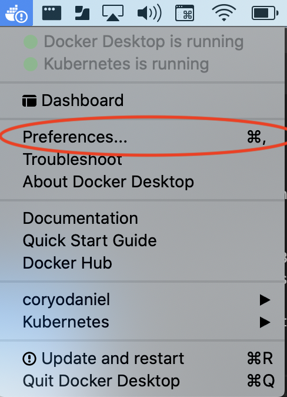
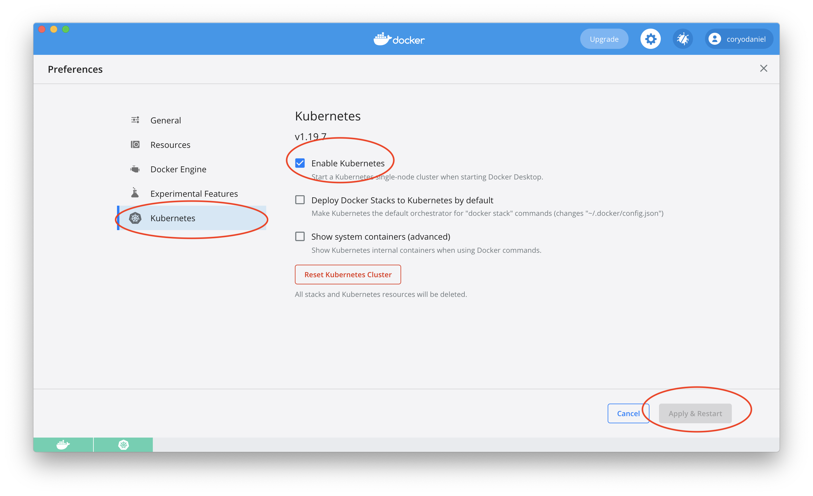
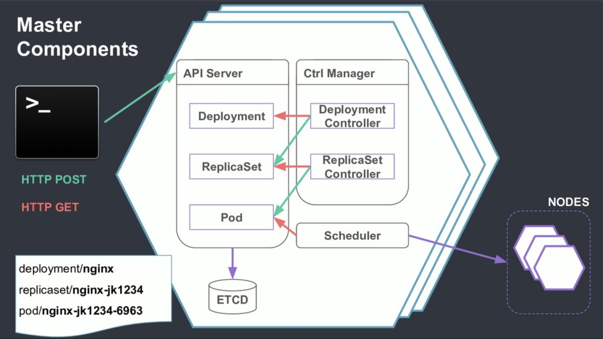

---
# Built w/ https://marpit.marp.app/markdown
marp: true
theme: gaia
class: 
  - gaia
---
<!-- _class: gaia lead -->
# Intro to Kubernetes


--- 
### Setting up a cluster
<!-- _class: gaia lead -->

Install [docker desktop](https://hub.docker.com/editions/community/docker-ce-desktop-mac).

---
### Enable Kubernetes
<!-- _class: gaia lead -->


---
<!-- _class: gaia lead -->


---
### Check `~/.kube/config`

<!-- Enabling k8s will add an entries to ~/.kube/config for the k8s server and authentication. -->

```shell
grep "kubernetes.docker.internal" ~/.kube/config
```

You should see:

```
server: https://kubernetes.docker.internal:6443
```


---
### Install `kubectl`

```shell
brew install kubectl
# command completion for zsh
source <(kubectl completion zsh)
alias k=kubectl
complete -F __start_kubectl k
```

Run the following, you should see similar output _Client Version_ **and** _Server Version_:
`kubectl version` 

```
Client Version: version.Info{Major:"1", Minor:"19"...}
Server Version: version.Info{Major:"1", Minor:"19"...}
```

---
### `kubectl` Whirlwind Tour

<!-- It's pronounced "kube cartel" -->

Verb/Resource based interface

_Nodes_ are the VMs that run your docker images.

`kubectl get nodes` 

<!--
You'll rarely interact with these, but you can still inspect them!
-->

_Namespaces_ are virtual clusters. You'll generally work in _default_.

`kubectl get namespaces`

<!-- 
* virtual cluster, arguably soft multitenancy
* network policies, resource limitations, security policies, and more
-->


---
### `kubectl` Whirlwind Tour

**kubectl** acts on an _extendable_ OpenAPI 3 API hosted by the Kubernetes' control plane nodes.

Setting the verbosity on a command will show resource URLs and other request metadata.

`kubectl get namespaces -v8`

You can also use **kubectl** to inspect which resource types are available on a cluster:

`kubectl api-resources -oname`

---
### `kubectl` Whirlwind Tour

**kubectl** can also manage and deploy workloads in Kubernetes.

The `apply` command is an idempotent deployment command.

<!--
Feel free to run the following command a few times, you should see nothing change since the manifests haven't changed.
-->

`kubectl apply --filename ./manifests/metrics-server.yaml`

Whats in here?

`grep -i "^kind:" manifests/metrics-server.yaml`

<!--
You can also 'delete' a manifest. Note that that manifest has _many_ resources inside of it.
You will generally define resource manifests as a cohesive unit of functionality
--->

We should see the _metrics-server_ pod starting up.

`kubectl get pods --namespace kube-system`

<!--
We'll use this to inspect CPU usage later.
-->

---
### `kubectl` Metadata and Help

<!-- earlier we saw the resources command -->

View all resource types this cluster can manage:
`kubectl api-resources`

> Look, ma, no need to Google.

<!-- Documentation for all resource types are available from the CLI -->
```shell
# Top level info
kubectl explain pod

# View docs on a specific field, nest to your
kubectl explain pod.spec.containers.image

# View docs for the whole enchilada
kubectl explain pod --recursive
```

---
### What _is_ a Pod?

* 1 or more collocated docker containers
* acts as a logical host
* shares volumes
* shares network
* live and die as a unit

Create a pod:
<!-- not setting the namespace will put it in "default" -->
`kubectl apply --filename ./manifests/pod.yaml`

<!--
* Web App + Redis over localhost, redis can cluster w/ other pods over virtual network
* Nginx reverse proxy
-->

---
### What _is_ a Pod?

Inspect the definition from the cluster:

<!--
The manifests are stored in the cluster after "applying"
-->

`kubectl get pod/example-app --output yaml`

* apiVersion
* kind
* metadata
* spec

<!--
API Version: Allows you to have duplicate "kinds" of resources without conflict
Metadata: name, namespace, labels, annotations
Spec: attributes of the resource
  Note: containers (image, ports, env, resources)
  You can learn more by using kubectl explain
-->

---
### Exploring a Pod

* List all pods in namespace: `kubectl get pods`
* Get details about a pod: `kubectl describe pod/example-app`
* Follow logs from a pod: `kubectl logs pod/example-app --follow`
* Watch events in the cluster sorted by time: `kubectl get events --sort-by=.metadata.creationTimestamp --watch`

<!--
Start the command in a new terminal and open a second terminal
-->

---
### Exploring a Pod

<!-- 
So we can see that we have a pod running and its outputting logs, how do we access it?
We saw a port number in the YAML output... but where _is_ that bound.
The answer is no where we can get to right now.
Workloads and traffic routing are two separate concepts in k8s 
-->

Two ways to access a pods port:

<!--
Just run the first command, the second is great for debugging 
-->

* Create a service to serve the workload: `kubectl apply -f manifests/service.yaml`
* Temporarily expose a port: `kubectl port-forward pod/example-app 8080:8080`

---
### Exploring a Pod

<!-- 
You should still have the levents terminals open.
-->

In a second window:

`kubectl get pods/example-app --watch`

Open localhost:8080 and click through any insecure notices:

`open http://localhost:8080`


<!--
Click "Crash the app"
* we should see: kubernetes restart the failed container
* Look at the events tab and we should see a series of events
* navigate back to http://localhost:8080 (make sure not to refresh or it will hit /crash)
-->

---
### Exploring a Pod

See current CPU and memory utilization:

`kubectl top pods`

<!--
* Click "Exhaust Memory" a few more times and keep running kubectl top pods
* Switch back to "events" and you should see that the pod was restarted because it exceeded its memory limits
-->

--- 
### Exploring a Pod

Look for "last state" of the pod by describing it:

`kubectl describe pods/example-app`

<!--
We should see OOMKilled
So we saw kubernetes recover a pod that had crashed and restart a pod that had exhausted its memory allocation.
If we clicked "Exhaust CPU" what you would see is tht the pod would keep running and kubernetes would cap its CPU utilization.
-->

Delete the pod when you are done:

`kubectl delete -f manifests/pod.yaml`

<!--
Note: we left the service deployed 
-->


---
### What *is* a Replicaset?

A replica set:

* Defines a number of replicas to run of a specific pod. This gives us horizontal scale and redundancy.
* Offers no deployment logic
* Wraps a Pod

Are they _really_ built on each other?

```shell
kubectl explain replicaset.spec.template.spec > replica-template.txt
kubectl explain pod.spec > pod.txt
diff pod.txt replica-template.txt
```

<!--
The only difference you should see is the front matter describing the resource type.
A replica set is included in the manifests directory, but we will skip it as it is rarely used directly.
-->

---
### What *is* a Deployment?

A deployment:
* Wraps ReplicatSets (notice the plural form)
* Provides deployment logic for ReplicaSet (RollingUpdate, Recreate)
* Defines revision history for instance rollbacks

Deploy our application:
`kubectl apply --filename ./manifests/deployment.yaml`

---
### Explore a Deployment

The most important feature of a deployment is how the deployment is performed:

<!--
Two strategies: Recreate (deletes and redeploys) and RollingUpdate (provides availability)
Recreate is great for development when you want something to happen fast
-->

```yaml
strategy:
  type: RollingUpdate
  rollingUpdate:
    maxSurge: 1
    maxUnavailable: 1
```

Controlling rollout:

* maxSurge - consumes more resources, but maintains availability
* maxUnavailable - consumes same resources, but sacrifices availability

<!--
* maxSurge and maxUnavailable can be fix num or percent
* maxSurge starts a new pod, once its up, stops an old pod
* maxUnavailable stops an old pod, once its stopped, it starts a new pod

* Using a rollingupdate v1 and v2 of your app will be running at the same time, backwards compatible code/migrations are important!

* Resque scheduler? Better to have two versions at once or no version running while rollout happens
-->

---


---
### A Brief Tangent on Services

Visit localhost again:
`open http://localhost:8080`

**We deleted our pod, why does this service still work?!**

<!--
Does anyone know why this works?
-->

```yaml
spec:
  type: LoadBalancer
  selector:
    app: example-app
  ports:
  - port: 8080
    targetPort: web
```

<!--
Network routing and workloads are decoupled in kubernetes.
You attach them by using labels and label selectors, here this service will forward traffic to any pod with the 
labels "app: example-app", which our deployment also has defined.
-->

---
### Horizontal Pod Autoscaler

<!-- 
A deployment defines a static number of pods to run, but what if our traffic changes throughout the day?
-->

* Set a minimum and maximum number of pods for a Deployment
* Set a target CPU utilization across the set of pods
* Can access alternative metrics sources to scale based on SLOs (sick!)

---
### Horizontal Pod Autoscaler

`kubectl apply -f ./manifests/horizontalpodautoscaler.yaml`

```yaml
  minReplicas: 1
  maxReplicas: 10
  targetCPUUtilizationPercentage: 50
  scaleTargetRef:
    name: example-app  
    apiVersion: apps/v1
    kind: Deployment
```

Lets watch the pods in our deployment:

`kubectl get pods --watch`

<!-- 
You should only see one pod 
Go back to our web app and click "exhaust CPU"
We should see more pods start to appear in our watch command
If you click "exhaust CPU" a bunch, you'll see a bunch of pods start up
-->

---
### Cleanup our Deployment, Service, and HPA

`kubectl delete -f ./manifests/horizontalpodautoscaler.yaml`
`kubectl delete -f ./manifests/deployment.yaml`
`kubectl delete -f ./manifests/service.yaml`

---
### What _is_ a Job?

<!--
Everything we have seen so far have been request-based workloads 
--->

Kubernetes also supports running 'job' workloads.

`kubectl apply -f ./manifests/job.yaml`

We can use the same commands we used the other resource types:

```shell
kubectl get jobs
kubectl get pods
kubectl explain jobs.spec
```

We can combine commands to dynamically get our pod name:

```shell
kubectl logs pod/$(kubectl get pods --selector=job-name=succeeding-job --output=jsonpath="{.items[0].metadata.name}")
```

<!--
This last command uses kubectl output and a selector to make a jsonpath query that outputs the name of the pod created by the job.

-->

---
### Jobs May Fail


`kubectl apply -f ./manifests/failing-job.yaml`

```yaml
backoffLimit: 3
template:
  spec:
    restartPolicy: OnFailure
    containers:
    - name: example-app
      image: coryodaniel/example-app
      command: ["/example-app",  "-mode=job", "-job-force-fail", "-job-min-sleep=10"]
```

---
### Job Lifecycle Controls

Kubernetes provides various controls for jobs:

* restartPolicy
* activeDeadlineSeconds
* backoffLimit
* completions
* parallelism

<!--
* restartPolicy - Never, OnFailure - restart the pod or make a new one when failing
* activeDeadlineSeconds - Timeout before the job should be stopped
* backoffLimit - number of retries in event of failure
* completions - how many times to run the job (could be process a mailing list, one email per run)
* parallelism - how many pods to run in parallel to finish the job
-->

---
### Other Resources

There are lots of other resource types to explore:

```shell
kubectl api-resources
```

A few of the more common resources:

* CronJob
* Services
* StatefulSets
* ConfigMaps
* Secrets

---
### Thanks!

* [Slides & Source](https://github.com/coryodaniel/talks/tree/master/intro-to-kubernetes)
* [K8s Basics](https://kubernetes.io/docs/tutorials/kubernetes-basics/)
* [Katacode Interactive K8s Tutorials](https://www.katacoda.com/courses/kubernetes)